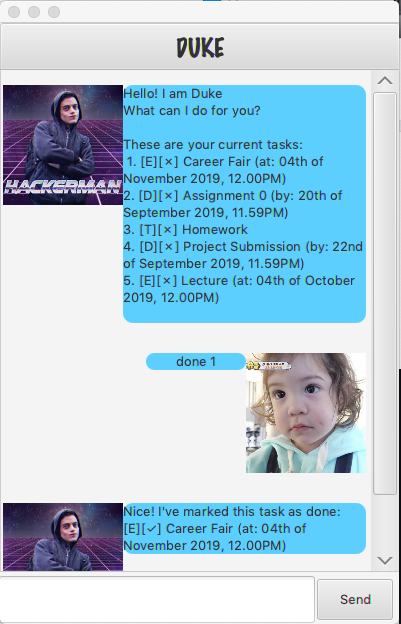
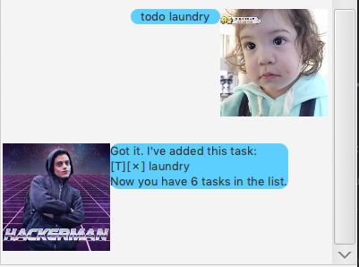
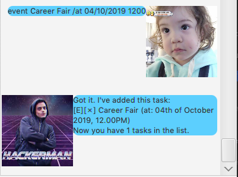
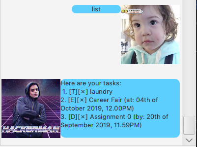
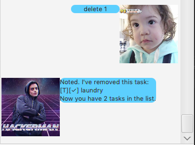

# Duke User Guide

## Features 

### Update tasks 
* Todo tasks
* Event tasks
* Deadline tasks

#### List tasks
Lists all tasks in Duke.

#### Mark task as done
Marks completed task as done.

#### Find task
Finds tasks in the list of tasks that contains the provided keyword.

#### Delete task
Deletes unwanted task from list of tasks in Duke.

#### 
## Usage

### `todo` - Adds a Todo task

Adds a Todo task into Duke, with a description.

Format: `todo <description>`

Example usage: `todo Laundry`

Expected outcome: `[T][✗] Laundry` will be added to list of tasks.
 

### `event` Adds an Event task

Adds an Event task into Duke, with a description, date and time.

Format: `event <description> /at <date time> (dd/MM/yyyy HHmm)`

Example usage: `event Career Fair /at 04/10/2019 1200`

Expected outcome: 
`[E][✗] Career Fair (at: 4th of October 2019, 12.00pm) ` will be added to the list of tasks.
 

### `deadline` Adds a deadline task
Adds a Deadline task into Duke, with a description, date and time.

Format: `deadline <description> /by <date time> (dd/MM/yyyy HHmm)`

Example usage: `deadline Assignment 0 /by 20/09/2019 2359`

Expected outcome: `[D][✗] Assignment 0 (by: 20th of September 2019, 11.59pm)`
 

### `list` Lists all tasks
Lists all tasks in Duke with their description as well as date and time if applicable.

Format: `list`

Example usage: `list`

Expected outcome: 
`1. [T][✗] Laundry`  
`2. [E][✗] Career Fair (at: 4th of October 2019, 12.00pm)`  
`3. [D][✗] Assignment 0 (by: 20th of September 2019, 11.59pm)`
 

### `done` Marks task as done
Marks task at the given index as done.

Format: `done <index>`

Example usage: `done 1`

Expected outcome:  
`Nice! I've marked this task as done:`
`[T][✓] Laundry`
 

### `find` Finds task
Finds tasks that contains given keywords.

Format: `find <keywords>`

Example usage: `find Career`

Expected outcome: 
`Here are the matching tasks in your list:`  
`1. [E][✗] Career Fair (at: 4th of October 2019, 12.00pm)`
 

### `delete` Deletes task
Deletes task at the given index as done.

Format: `delete <index>`

Example usage: `delete 1`  

Expected outcome: 
`Noted. I've removed this task:` 
`[T][✓] Laundry` 
`Now you have 2 tasks in the list.`
 

